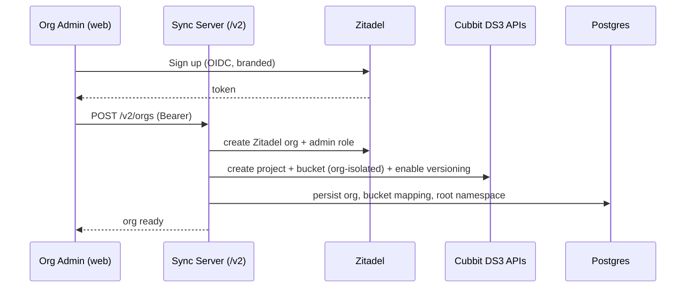
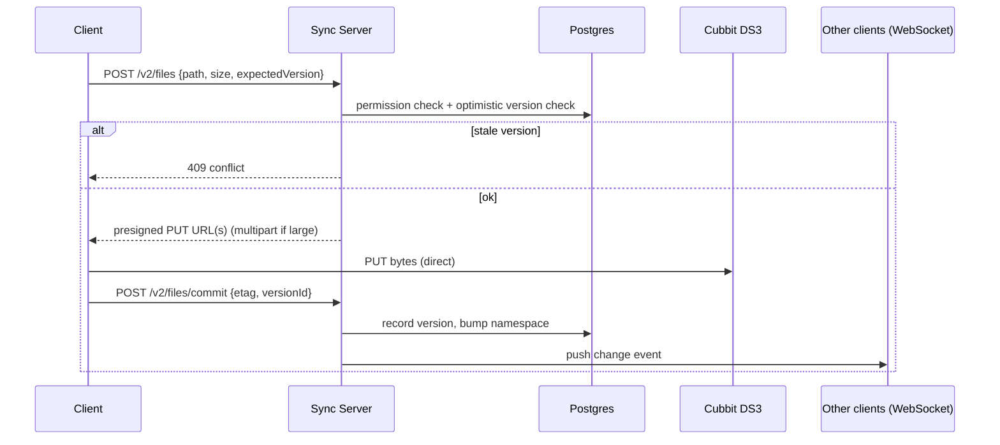
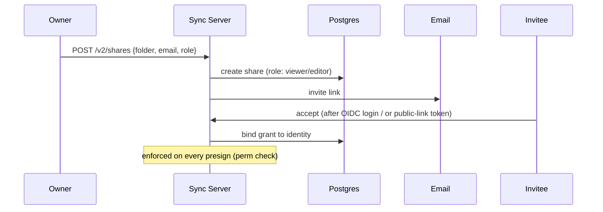
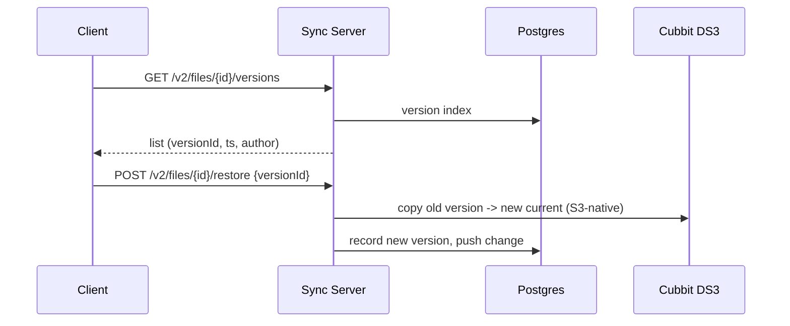

# DS3 Drive — Enterprise Platform (v3.0) North-Star Design

**Status:** Draft / north-star. Foundation (Layer 0) **and** feature-layer directions locked; each area detailed in its own per-part spec.
**Date:** 2026-07-16
**Sequencing:** Execution starts **after** the v2.0.0 Windows milestone wraps (Phase 17.1 UAT + remainder). This spec is written ahead so it's ready.
**Supersedes/extends:** builds on `2026-05-26-cross-platform-rewrite-design.md` (Rust core + native shells).

---

## 1. What this is — and why it's a pivot, not a refactor

Today DS3 Drive is a **thick sync client** with a deliberate constraint: *no custom backend — the client talks directly to Cubbit IAM/Composer + S3* (`PROJECT.md`). Every requirement in this effort breaks that constraint.

What we're building is a **Dropbox-class enterprise SaaS platform built on Cubbit DS3**: server-mediated identity, sharing, permissions, versioning, web consoles, per-org provisioning, audit, whitelabel. This is a **company-level bet with a different cost structure and threat model** (we now run and secure a backend 24/7), not a client refactor. Naming that up front because it reframes scope for every downstream decision.

It is also **~12 subsystems = a multi-quarter roadmap**, not one spec. This document is the north-star: it locks the foundation and scopes each feature area. Each feature area then gets its **own** brainstorm → spec → plan cycle ("discuss per parts").

---

## 2. Locked foundation (Layer 0)

| Decision | Choice | Rationale |
|---|---|---|
| **Data plane** | **Presigned URLs** (DS3-confirmed supported). Bytes go **client ↔ DS3 direct**. | Server never in the byte path → scales, keeps Cubbit's edge. Client holds **no** standing credential; each URL is one object, short-lived, minted only after a permission check. STS not needed (and DS3 has no STS yet). |
| **Proxy tier** | **Not in v1.** Presigned URLs cover shared **and** public/anonymous downloads (server mints a presigned GET on link-token validation — no client credential, no proxy). | Deferred entirely; revisit only if a future feature needs the server in the byte path (server-side transforms/AV). Keeps v1 simple. |
| **Identity** | **Zitadel** (self-host or cloud), fronted by our own domain (`auth.ds3drive.com`). | Orgs are first-class (maps to per-org model), native SAML/OIDC/SSO, lighter ops than Keycloak. Never build identity. |
| **API front door** | **`api.ds3drive.com/v2/…`** (axum), Bearer-validated against Zitadel JWKS. | One control-plane surface for all app calls. Client authorizes from Postgres server-side. |
| **Login flow** | **OIDC Authorization Code + PKCE** against branded Zitadel. **Not** a `/v2/login` password proxy. | A password proxy (ROPG) throws away SSO/MFA/federation — the whole reason for Zitadel. Web = BFF (httpOnly cookie); native = ASWebAuthenticationSession / AppAuth (token in Keychain/Credential Manager). Branded Zitadel = whitelabel login for free. |
| **Server stack** | **Rust + axum, reusing `core/` crates** (`ds3-s3`, `ds3-auth`, `ds3-models`). | Zero re-implementation of S3/auth/presigning; one source of truth shared with the clients' FFI core; single language across core + server. |
| **Primary DB** | **Postgres** = namespace source of truth (paths, versions, permissions, audit). S3 = bytes + native versions only. | Relational + transactional workload (optimistic concurrency, permission joins). Same class Dropbox/Nextcloud run on. Bytes in S3 → tiny rows, scale axis is row count (Postgres handles 100Ms with partitioning). |
| **Bus/cache** | **Redis from day 0** — WebSocket pub/sub fan-out + presence + token/rate cache. | Multi-instance HA is expected immediately at this scale (petabyte target); provisioning it up front avoids a later retrofit. Not a database — a message bus. |
| **Change/sync** | Server authorizes every write → knows every change → **WebSocket :443 push**, no polling. | Kills polling latency; :443 sails through corporate proxies/VPN. |
| **Conflicts** | Optimistic concurrency **at authorization time** — server checks expected version before minting a PUT URL. | Rejects stale writes up front; strictly better than today's after-the-fact ETag conflict copies. |
| **Deployment & tenancy** | **Two levels.** (1) Each **reseller** self-hosts a **branded instance** (Docker/K8s) — sync server + Zitadel + Postgres/Redis — connected to **a Cubbit DS3 instance** (Composer on-prem *or* Cubbit cloud — a deployment detail; super-admin configures endpoint + admin creds). (2) Within it, many **organizations** sign up; each org = **project/bucket** provisioned via DS3 management APIs, isolated. | Resellers ship DS3 Drive as their own Dropbox on Cubbit storage. Each instance is itself multi-tenant. Build-time whitelabel. Requires DS3 **management** APIs (project/bucket/IAM CRUD) at the configured endpoint — confirm. |

### Identity is swappable (not locked to Zitadel)
Keycloak (or any OIDC IdP) must stay a few-days adapter away, not a rewrite. Honor three rules from day 1:
1. **Auth via standard OIDC only** — validate JWTs vs the IdP's JWKS + OIDC discovery. Fully portable; a swap is config (issuer/client/JWKS).
2. **One seam:** isolate the vendor-specific *management* API (create org / invite user / assign roles) behind a Rust **`IdentityProvider` trait** — `ZitadelProvider` now, `KeycloakProvider` later. Do **not** abstract auth (already standard); **do** wrap management.
3. **Own the ID mapping** — users/orgs keyed on *our* Postgres PKs, mapped to the OIDC `sub`. Never foreign-key on the IdP's internal IDs, so a swap re-links instead of breaking.

Residual switch cost = user-record migration (password hashes/sessions don't port between IdPs) — inherent to any IdP change, softened by SCIM/federation. Cheap to honor now, expensive to retrofit.

### Named upgrade paths (deferred behind real triggers — do NOT build day 1)
- **SpiceDB (Zanzibar)** — if permissions get deeply nested / cross-org at scale. Start with a Postgres perms table.
- **ClickHouse** — if audit write volume/analytics hurt. Start with a partitioned Postgres audit table.
- **Meilisearch / Elasticsearch** — if file search becomes a feature. Start with Postgres FTS.

---

## 3. Architecture

```
                          ┌────────────────────────────┐
   End users ──login───▶  │  Zitadel (OIDC/SAML/SSO)   │  auth.ds3drive.com
   (mac/win/ios/web)      │  branded, our domain       │  (whitelabel login)
                          └──────────────┬─────────────┘
                                         │ OIDC token (PKCE)
        ┌────────────────────────────────▼──────────────────────────┐
        │        SYNC SERVER — control plane (Rust/axum)             │
        │  api.ds3drive.com/v2                                       │
        │  • validate Zitadel JWT     • Postgres = namespace SoT     │
        │  • permissions/shares/versions/audit                       │
        │  • WebSocket :443 push      • holds Cubbit DS3 org key      │
        │  • mints presigned URLs     • provisions bucket/proj/org    │
        │  • reuses core/ crates (ds3-s3, ds3-auth, ds3-models)      │
        └───────┬──────────────────────────────────┬─────────────────┘
                │ control (JSON / WS)               │ presigned URL
                │                                   │ (1 object, short-lived)
   ┌────────────▼────────────┐          ┌───────────▼────────────┐
   │  Clients                │──bytes──▶│  Cubbit DS3 (S3)        │
   │  mac/win FileProvider   │  direct  │  org-isolated buckets   │
   │  ios/web in-app browser │◀─bytes───│  + native versioning    │
   └─────────────────────────┘          └─────────────────────────┘
     (no proxy tier in v1 — presigned GET covers shared + public/anonymous
      downloads too; revisit only for future server-side transforms/AV)

   Data tier:  Postgres (metadata/perms/versions/audit)  +  Redis (pub/sub/presence/cache)
```

---

## 4. Key flows

### 4.1 Org signup + provisioning


### 4.2 Login (OIDC + PKCE, branded)
```mermaid
sequenceDiagram
    participant C as Client (native/web)
    participant Z as auth.ds3drive.com (Zitadel)
    participant API as Sync Server
    C->>Z: Authorization Code + PKCE (+ SSO/SAML if enterprise)
    Z-->>C: code -> token (native: Keychain; web: httpOnly cookie via BFF)
    C->>API: /v2/... (Bearer)
    API->>API: validate JWT vs Zitadel JWKS + authorize from Postgres
```

### 4.3 Upload (presigned, bytes direct)


### 4.4 Share invite


### 4.5 Version restore


---

## 5. Decomposition / roadmap

```
LAYER 0 — FOUNDATION  ◀ first deep-dive (MVP of the pivot)
  Sync server (axum, reuse core/) · Zitadel + branded OIDC · client re-point
  · Postgres + Redis · presigned data plane · WebSocket push · per-org provisioning
  → Prove server-mediated model on ONE platform pair (e.g. web + macOS) end-to-end.

LAYER 1 — ENTERPRISE FEATURES  (each own spec; all depend on L0)
  Sharing + links + granular permissions · Versioning · Audit + force-disconnect

LAYER 2 — SURFACES  (depend on L0, partly L1)
  Web dashboards — Next.js/TS, built super-admin → org-admin → end-user
  · Mobile in-app browser (dual with FileProvider, like Dropbox)

CROSS-CUTTING  (thin; wire early, build minimal)
  Whitelabel (branding-as-config) · VPN/proxy (system proxy + custom CA)
```

**MVP of the pivot = Layer 0 on one platform pair**, proving the server-mediated model before any enterprise feature. Nothing in Layer 1/2 is real until Layer 0 ships.

---

## 6. Feature areas — decisions (details in per-part specs)

| # | Area | Decision |
|---|---|---|
| 1 | **Sharing + links + permissions** | Web app **shows folders**; downloads issue **presigned URLs** (works for shared + public/anonymous — no proxy). Perms in Postgres, enforced at presign. Roles viewer/editor/owner per folder. Private-share URLs kept short-lived; public-link tokens map to presign-on-validate. |
| 2 | **Versioning** | **Match incumbents (Dropbox / Google Drive / Nextcloud / Proton Drive):** full version history with preview + restore, time-based retention. S3-native versioning + Postgres version index. |
| 3 | **Web dashboards** | **Next.js + TypeScript**, on the `/v2` API. Build **in order: super-admin → org-admin → end-user** (configure tenant/system first, then onboarding, then user surface). |
| 4 | **Mobile in-app browser** | **Dual, like Dropbox** — keep FileProvider **and** add in-app browse/preview/download. Update `PROJECT.md`'s "Files-app-only" out-of-scope entry when Layer 2 starts. |
| 5 | **Audit + force-disconnect** | **Queryable history** (no real-time streaming for v1). Partitioned Postgres audit table; per-user + org views. Force-disconnect = revoke Zitadel session + drop WebSocket (+ rotate org key nuclear option). |
| 6 | **VPN / proxy** | **Super simple for v1** — honor system proxy + custom CA; :443 WebSocket covers the rest. No dedicated subsystem. |
| 7 | **Whitelabel** | **Build-time** — per-customer branding baked at build (design tokens + asset bundle + branded Zitadel login). Wire branding-as-config from day 1 so it's not retrofitted. |

---

## 7. Risks & assumptions

- ✅ **RETIRED:** presigned-URL support (confirmed by Cubbit team). Was the #1 risk.
- **DS3 access model = project-based + ACLs; no bucket policies, no STS.** So per-prefix scoping is *not* enforceable client-side via policy — enforcement lives in the **server (presign gate)**, never in a handed-out key. Design must never hand end users a raw DS3 key.
- **DS3 versioned deletes are irreversible** — versioning UX must account for this.
- **Zitadel multi-tenant ops** — per-org config, custom domains, SCIM at scale is new operational surface; validate self-host vs cloud early.
- **Permission model scale** — start Postgres table; SpiceDB is the escape hatch, not the starting point.
- **Mobile reversal** — in-app browser contradicts the shipped "Files-app-only" decision; **resolved: dual** (FileProvider + in-app, like Dropbox). Update `PROJECT.md` when Layer 2 starts.
- **Running a backend 24/7** — new on-call, security, and compliance burden the current architecture didn't have.

---

## 8. Non-goals (this cycle)
- Multi-cloud / generic S3 (Cubbit-native).
- Real-time collaborative editing (S3 has no locking; sync, not co-edit).
- Building identity (Zitadel does it).
- GraphQL (REST + OpenAPI; add GraphQL only if a real integrator demands it).
- A data-plane proxy tier (presigned covers all v1 downloads incl. public/anonymous; no proxy in v1).

---

## 9. Next step
Take **Layer 0** into its own detailed deep-dive spec (`/gsd` or brainstorm → writing-plans): sync server + Zitadel + client re-point + provisioning, one platform pair end-to-end.
